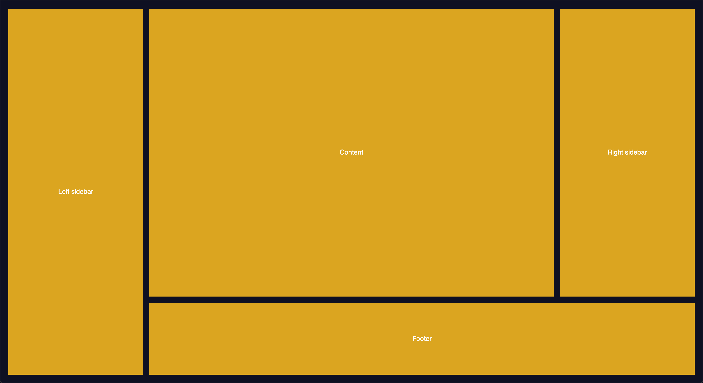

# CSS Grid Examples

A number of CSS Grid Examples to help understand how to set-up a grid layout using CSS.

## Getting Startted

1. Clone the repo
2. Run `npm start`
3. Un-comment the desired example in the `src/index.js` file
